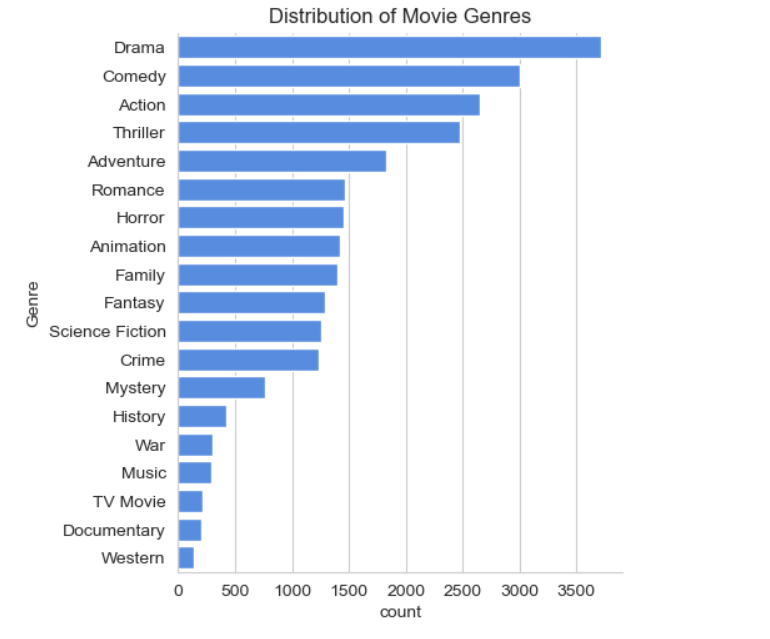
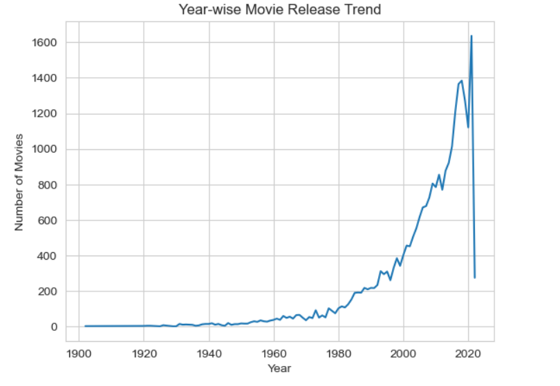

# Netflix-Data-Analysis
Exploratory Data Analysis on netflix dataset using Python

## Overview
This project performs Exploratory Data Analysis (EDA) on a movie dataset to identify trends in genres, ratings, popularity, and yearly releases.

## Tools Used
- Python
- Pandas
- NumPy
- Matplotlib
- Seaborn

## Key Analysis
- Genre distribution analysis
- Rating categorization (popular, average, below average, not popular)
- Year-wise movie release trends
- Most and least popular movies

## Key Insights
- Drama and Comedy are the most dominant genres
- Most movies fall under average rating category
- Movie releases increased significantly after 2000
- Only a few movies achieve very high popularity

## Sample Visualizations

## Conclusion
This analysis highlights trends in content production and audience preferences, showing growth in the film industry and variation in movie performance.

